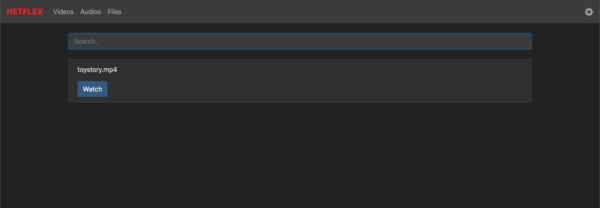
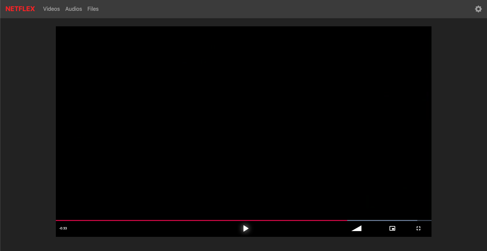
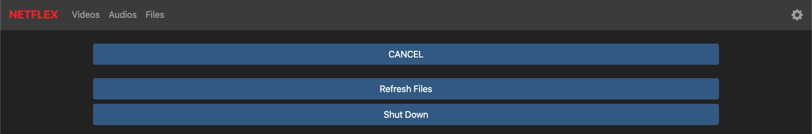

# NETFLEX

`Netflex` is an application to stream videos to a local network.

This project is a hobby-project intended to stream videos (stored on an external harddrive) from a RaspberryPi through a local network to different devices (including mobile) simultaniously.

## Features
- scan for videos and audios in file-system
- list all videos/files found in the scan (including a search)
- stream videos in a player [[VideoJs](https://videojs.com/)]
- scalable concurrent streams (multiple streams per thread)
- configuration file to set paths to scan for streamable files, ip/port, database-url or statics/template-paths

## Installation
This project is written in Rust which needs to be compiled to your operating system [[RustBook](https://doc.rust-lang.org/book/ch01-01-installation.html)].

It's recommended create a folder containing the following files:
- binary file
- configuration file "config.toml" [copy here](./config-local.toml)
- statics folder [copy here](./crates/plugins/web/static/)
- templates folder [copy here](./crates/plugins/web/static/)
- database-file 
	- only for caching scans, so a sqlite-file is suffient [[Sqlite](https://www.sqlite.org/index.html)]
	- the address has to be set in the configuration file! (it supports paths and urls)

## Project Structure
This part is addressed to those who want to change or extend this application.

The code follows the best-practices of Matklad [[Matklad.2021](https://matklad.github.io/2021/08/22/large-rust-workspaces.html)] using one top-level "crates" folder with all code that includes multiple workspaces.
These workspaces are used to divide the code and speed up compilation times.

The code is divided following the priciples of Domain-Driven-Design [[DDD](https://medium.com/microtica/the-concept-of-domain-driven-design-explained-3184c0fd7c3f)].
The goal is to have parts that rely on external crates and parts only contain the logic.

This is useful because Rust's ecosystem is still very young and in constant change.
It's not quite clear which frameworks are the best options (now or in the future).
Sometimes important features are still(!) missing but most of the time the projects itself are not stable and have 0.X.Y version numbers.

Keeping dependencies out of the main-logic has been proofed very useful, even during the "short" developement time for this project.
